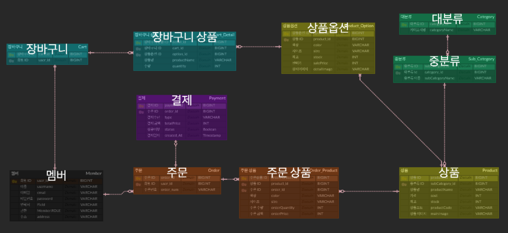
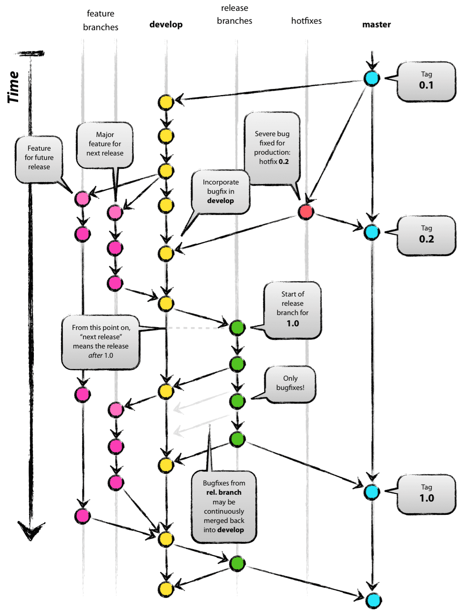

# e-market

## 개요

- 무신사를 모티브로 한 e-commerce 서비스의 서버를 설계및 구축

## 기술 스택 && 아키텍처
### 기술 스택
- JAVA
- SpringBoot
- MySQL
- MyBatis
### 아키텍처
- ERD

## 개발 방식
### Git flow

[참고] [우아한 형제들 기술 블로그](https://techblog.woowahan.com/2553/)

## Convention
[참고] [Google Java Style Guide](https://google.github.io/styleguide/javaguide.html)
